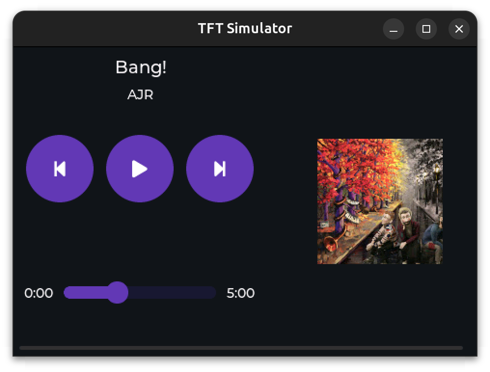

# TuneSyncMQ

[ESP32](https://www.espressif.com/en/products/socs/esp32) software to drive an
[Electrow ESP32 Terminal](https://www.elecrow.com/esp-terminal-with-esp32-3-5-inch-parallel-480x320-tft-capacitive-touch-display-rgb-by-chip-ili9488.html)
to control and display music playback via [MQTT](https://mqtt.org/).

## Contribute

Pull requests are welcome. For major changes, please open an issue first to discuss what you would like to change.

## License
[Mozilla Public License](https://choosealicense.com/licenses/mit/)
